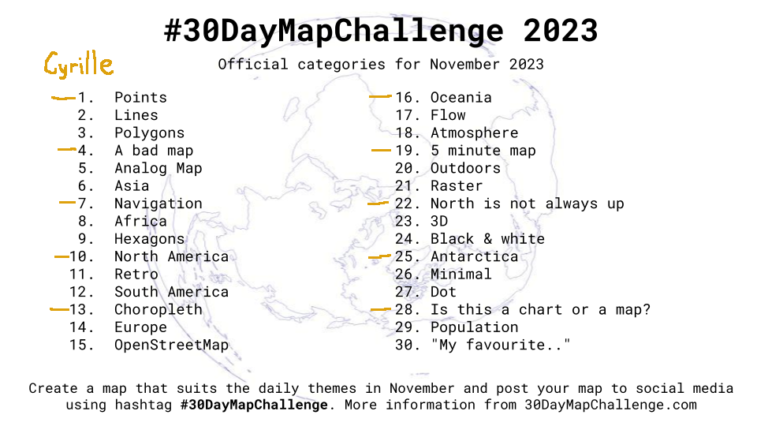
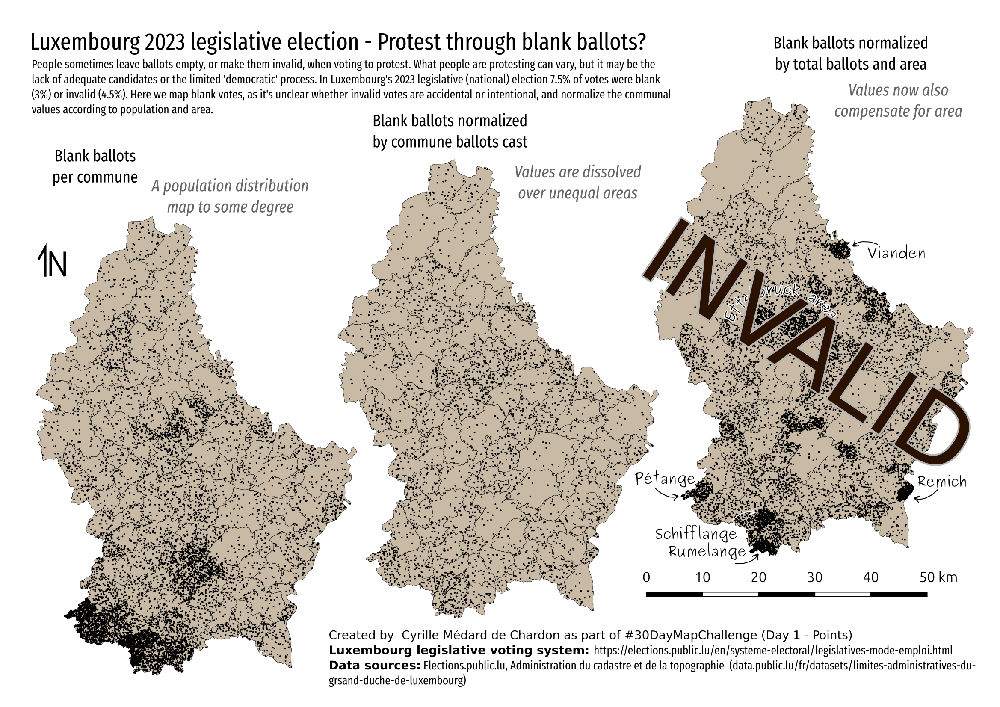
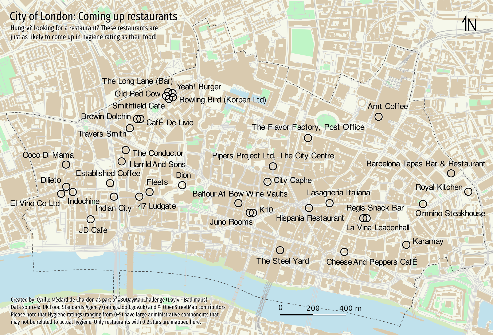
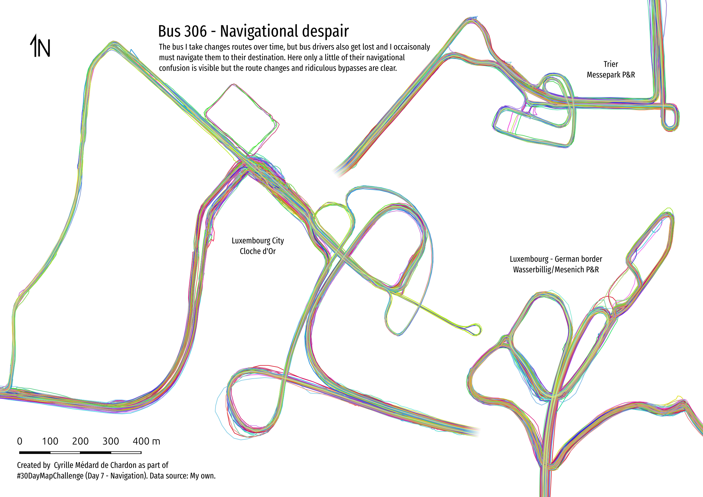
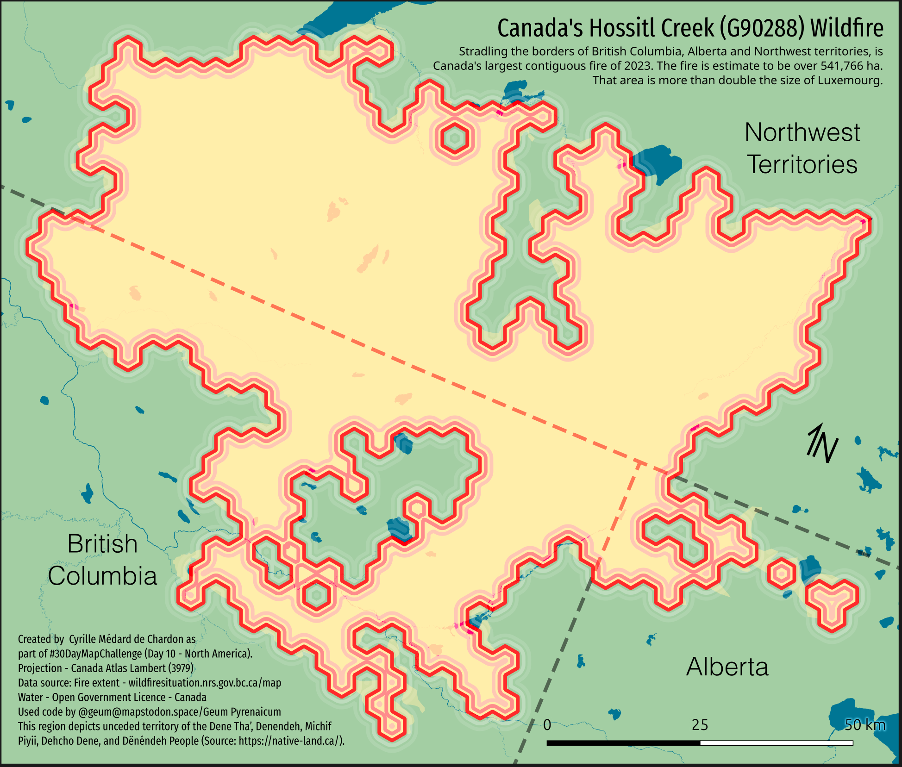

# 2023 Maps 

I am doing the #30DayMapChallenge with work colleagues Geoffrey and Kerry. I will only be doing every third day.

## Day 1 - Points

- Gathered data with Jupyter notebook by scraping website data into CSV.
- In QGIS normalized data, used "Random Points in Polygons" tool to generate points.
- Stylized map in QGIS and exported as SVG.
- In InkScape I added text, did formatting/layout.
- Would have liked to take data into R and do a bit of statistical analysis to see which, if any of these rates of blank ballots are significant.

## Day 4 - A bad map

- Used the osmdata library to get the features for the area from OSM
- Map basic map in R. I should have gotten the symbology nicer there first...
- Used InkScape to clean up data, organize, and then style a bit. Would have liked to do more, but... time.
- The 'bad' aspect is that I seem to be promoting the 'bad' restaurants, or simply showing 'bad' restaurants.

## Day 7 - Navigation

- Used my GPS tracks from bus commute
- Imported into QGIS and converted to paths
- Set scale of the three maps in layout manager and exported
- Added text and tweaked layout in InkScape

## Day 10 - North America

- I'm really impressed by the map by [@xcaeag](https://github.com/xcaeag/30DayMapChallenge-2023/blob/main/day9.md) and want to apply the method. This is taking a bit longer.
- I'm mapping one fire in North America, likely the largest of 2023. It's in Northern Canada at the BC, Alberta, and Northwest Territories border.
- I'm using hexagons, as per [the day 9 map method](https://github.com/xcaeag/30DayMapChallenge-2023/blob/main/day9.md) I'm replicating (and using code from).
- I automated the generation of svg tiles - don't have time to do the art, but these can help do that.
- For the SVG tiles, when exported from QGIS as SVG, then merged into one shape, the direction of the paths may matter. Also, QGIS duplicates each shape twice - so joining requires some separation.
- My adapted script allows a specific hexagon size, this helps in the SVG marker settings in QGIS, as you can double the value (as my reference svg tiles have double the size of the contained hexagon).
- This was much more complex than planned, and resulted in something that could have been done without the whole tiling to begin with. A lot was learned about the method though!
- [More details](day10/README.md)

