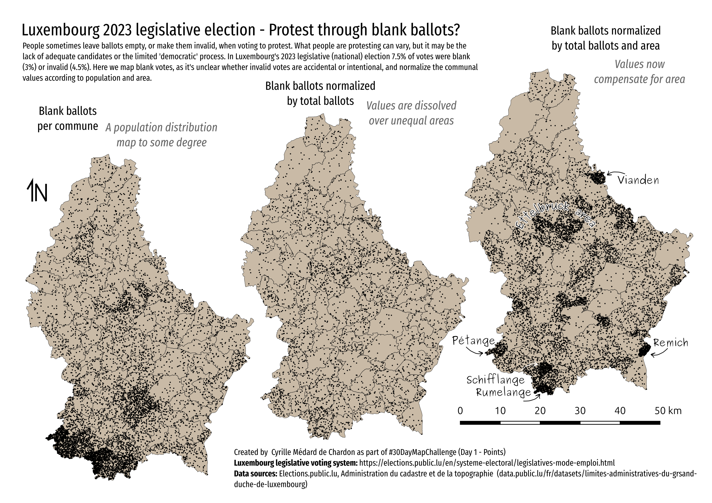

# Maps 

## Day 1 - Points

- Gathered data with Jupyter notebook by scraping website data into CSV.
- In QGIS normalized data.
- Stylized map in QGIS and exported as SVG.
- In InkScape I added text, did formatting/layout.
- Would have liked to take data into R and do a bit of statistical analysis to see which, if any of these rates of blank ballots are significant.

