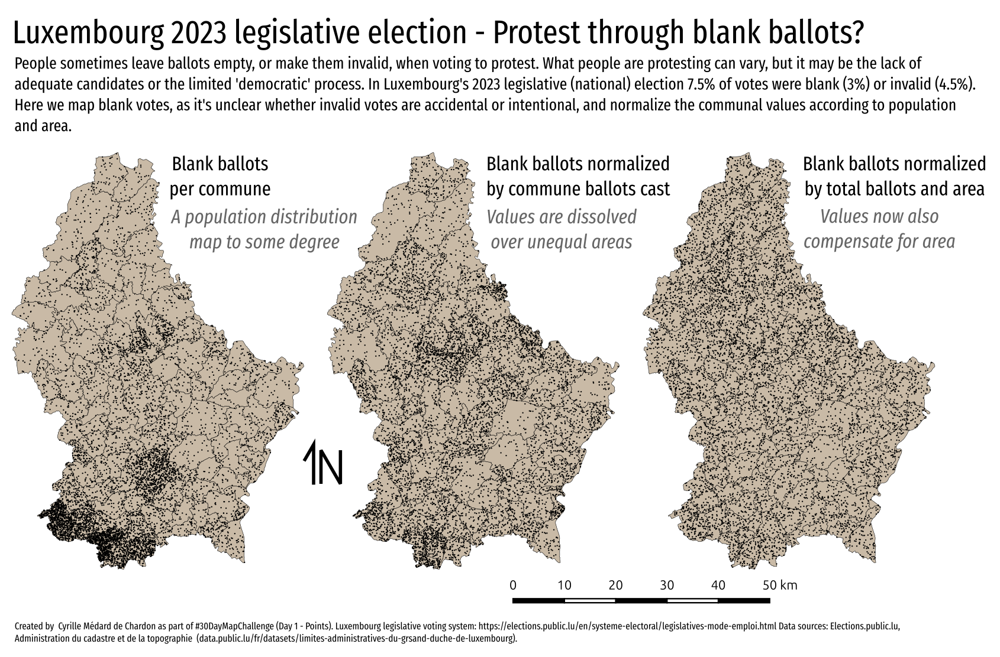
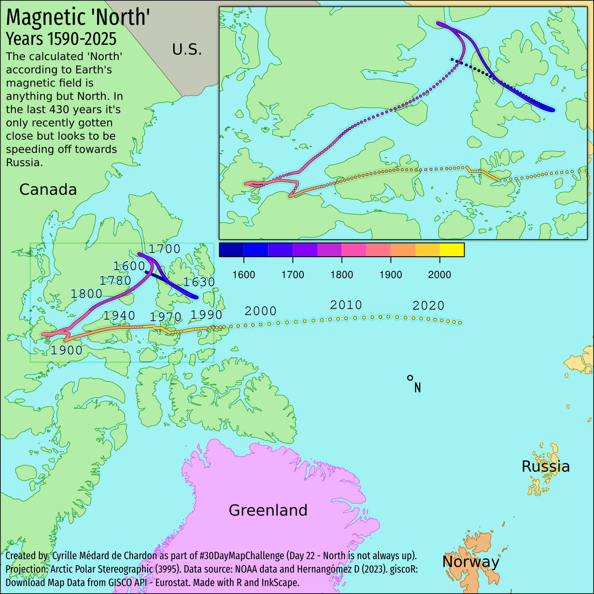

# 2023 Maps 

I am doing the #30DayMapChallenge with work colleagues Geoffrey and Kerry. I will only be doing every third day.

## Day 1 - Points

- Gathered data with Jupyter notebook by scraping website data into CSV.
- In QGIS normalized data, used "Random Points in Polygons" tool to generate points.
- Stylized map in QGIS and exported as SVG.
- In InkScape I added text, did formatting/layout.
- Would have liked to take data into R and do a bit of statistical analysis to see which, if any of these rates of blank ballots are significant.

- EDIT: There's an error in the last map. It's just wrong. See day 13 for more information.

### Updated map

There was an error in my earlier map (above).

The above map was made in QGIS while the one below was created in R.
The problem with QGIS is that I didn't track what calculations I did to create the values.

In R, the code is explicit and maintained, making a review or repair much easier.  The lesson is, when possible, always do it in R if it's anything other than pure cartography.

The map below shows that this is really not the best way to represent this type of data. See the [Day 13 map](#day-13---choropleth) for a better representation of similar data.

## Day 4 - A bad map

- Used the osmdata library to get the features for the area from OSM
- Map basic map in R. I should have gotten the symbology nicer there first...
- Used InkScape to clean up data, organize, and then style a bit. Would have liked to do more, but... time.
- The 'bad' aspect is that I seem to be promoting the 'bad' restaurants, or simply showing 'bad' restaurants.

## Day 7 - Navigation

- Used my GPS tracks from bus commute
- Imported into QGIS and converted to paths
- Set scale of the three maps in layout manager and exported
- Added text and tweaked layout in InkScape

## Day 10 - North America

- I'm really impressed by the map by [@xcaeag](https://github.com/xcaeag/30DayMapChallenge-2023/blob/main/day9.md) and want to apply the method. This is taking a bit longer.
- I'm mapping one fire in North America, likely the largest of 2023. It's in Northern Canada at the BC, Alberta, and Northwest Territories border.
- I'm using hexagons, as per [the day 9 map method](https://github.com/xcaeag/30DayMapChallenge-2023/blob/main/day9.md) I'm replicating (and using code from).
- I automated the generation of svg tiles - don't have time to do the art, but these can help do that.
- For the SVG tiles, when exported from QGIS as SVG, then merged into one shape, the direction of the paths may matter. Also, QGIS duplicates each shape twice - so joining requires some separation.
- My adapted script allows a specific hexagon size, this helps in the SVG marker settings in QGIS, as you can double the value (as my reference svg tiles have double the size of the contained hexagon).
- This was much more complex than planned, and resulted in something that could have been done without the whole tiling to begin with. A lot was learned about the method though!
- [More details](day10/README.md)

## Day 13 - Choropleth

Blank and invalid ballots in Luxembourg's October 2023 legislative election.

I wanted to do more with my Day 1 map... look at the statistics. I discovered an error in my methodology... need to fix Day 1 at some point.

Benefit of using R is reproducibility. Not exactly sure what I did wrong in Day 1 with QGIS.

## Day 16 - Oceania

- Made with R, rayshader, InkScape

Learned how to use the R package rayshader. Big install but impressive. Need a higher quality DEM next time.

## Day 19 - 5 minute map

- Made with QGIS, Inkscape

## Day 22 - North is not always up

- Made with R, giscoR, and Inkscape.

## Day 28 - Is this a chart or a map?

### Methodology

Get a DEM/DSM for an area of interst.

In QGIS draw a line with rounded turns, such as through a valley.
Use the Digitize with curve tool (Ctrl-Shift-G) for curves.

Import the scripts to the QGIS Processing Toolbox (PT) by clicking the Python icon in the PT and select "Add Script to Toolbox...".

The use the script **Perpendicular Line Creator** (perpindicular_lines_creation.py) to generate a bunch of perpendicular lines at a specific interval (e.g. 10m) and length (e.g. 200.5m). The extra 0.5m is to prevent edge cases later.

Now have the DEM/DSM be sampled along the perpendicular lines and create a tab separated file. The script output needs some work but functions fine - just needs a bit of cleaning the output. I'll fix it when I have time.

Use the **Raster Profile Extractor** (RSE) script (extract_profiles.py) provided.

Take the data into R, clean it up, and plot it.

You can also use RSE on satellite or aerial photography to sample the **colour** at the sampled locations.

Here's my result, using another path than the one shown above.

The a
