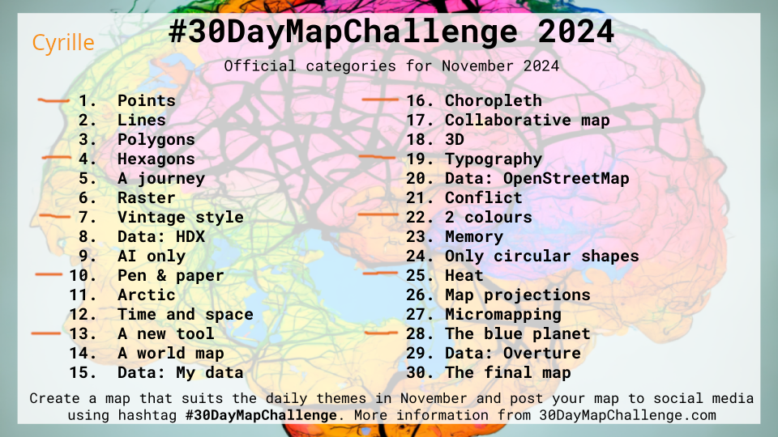
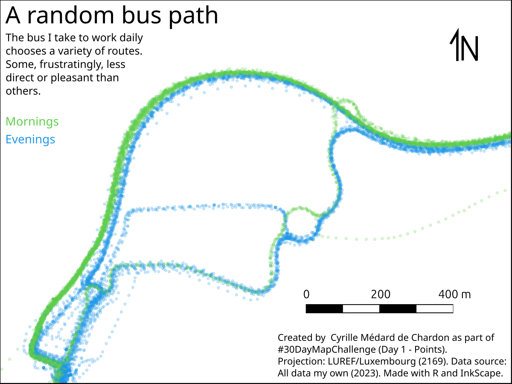
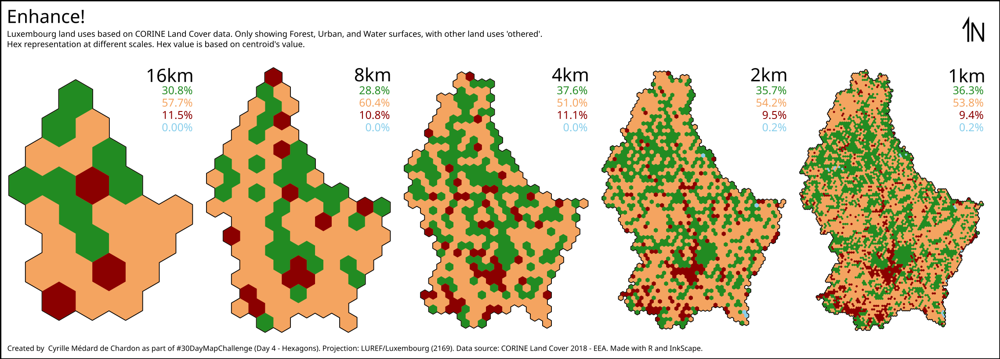

# 2024 Maps 

I am doing the #30DayMapChallenge with work colleagues Léandre and Sylvain. I will only be doing every third day.

## Day 1 - Points
Used R to connect to MariaDB and extract data - very effective. Converted to sf and plotted, saving as SVG.

Completed layout in Inkscape.

## Day 2 - Hexagons
Used R to modify the raw Corine Land Cover (CLC) data, create hexagons, used centroids to sample CLC. Used QGIS to reclassify as I was planning on doing something similar to Day 10 from 2023. Layout was exported from R, just some text added in Inkscape.

